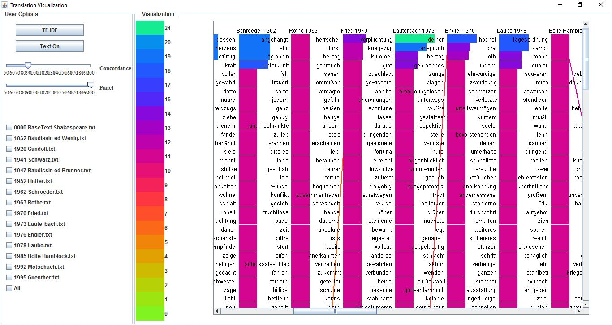
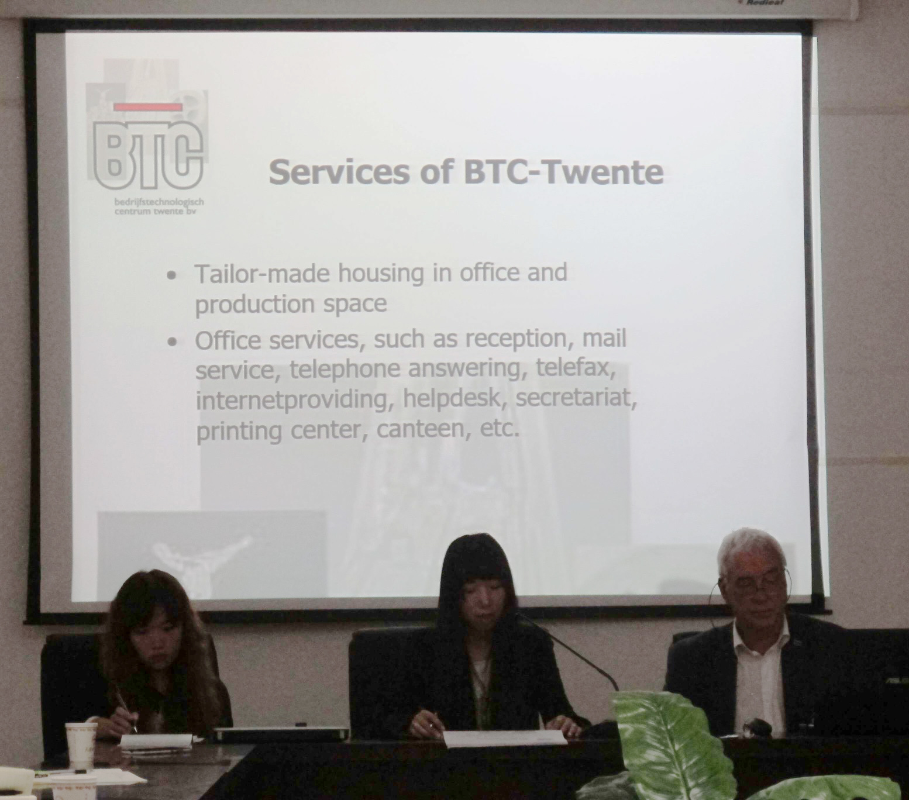

# Xiaoxiao Liu #

> Programmer, Translator

> Email: 889170@swansea.ac.uk

  

<a class="Experience" style="text-decoration:underline"><b>Education</b></a>

### Swansea University ###

* MSc Computer Science, <a class="myclass" style="text-decoration:underline">Expected Distinction;</a>

* Developed a text visualization tool to display the variation of tokens in different translation versions
[(Repository)](https://github.com/Xiaoxiao-Liu/CSCM10);

* Implemented a basic content management system
[(Repository)](https://github.com/Xiaoxiao-Liu/CMSystem);

* Dissertation: Interactive Visualization of Shakespeare’s _Othello_;
* Awarded for International Scholarship;

### Tianjin University of Technology ###

* MTI Engineering Professional Translation, <a class="myclass" style="text-decoration:underline">Distinction</a>;
* Core modules included:
  * Topic-based Interpreting - Grade: 90%
  * Principles of Translation - Grade: 87%
  * Translation (E-C) - Grade: 87%
  * Discourse and Translation - Grade: 98%
  * Computer-aided Translation - Grade: 96%
* Dissertation: Intel Processor Technical Specification Translation;
* Awarded for Special Freshman Scholarship;
* Awarded for Second Prize Scholarship;

### Linyi University ###

* BA English, <a class="myclass" style="text-decoration:underline">Upper-second class degree (2:1)</a>;
* Core modules included:
  * British and American Society and Culture - Grade: 96%
  * National and Global Economy - Grade: 90%
  * Business English Interpretation - Grade: 88%
  * American Literature - Grade: 82%
  * Basic Easy Japanese - Grade: 83%
  * English Grammar - Grade: 73%
* Dissertation: 10,000 words thesis: "On the Image of Amaranta from the Perspective of Solitude";

<a class="Experience" style="text-decoration:underline"><b>Work and Intern Experience</b></a>

### Tianjin University of Technology, China ###

__Escort Interpreter__ (Sep 2015 - Jan 2016)

* Served as an escort interpreter in International office of Tianjin University of Technology for conferences and banquet;
* Served as an escort interpreter for <a class="myclass" style="text-decoration:underline">Mr. Rob de Koning</a> (Director of the Business and Technology Center Twente);

### Shandong Smart Translation Service Co. Ltd, China  ###

__Translator__ (Dec 2014 – Feb 2015)

* Translated technical material, commercial material, and legal documents;
* Translated legal documents for The Center for Legal Assistance of Haidian District in Beijing;
* Translated materials with the assistant of SDL Trados Studio 2010;

### Sunmoon Education Group, China ### 

__Human Resources Assistant__ (April 2014 - Oct 2014)

* Recruited staffs, which involves developing job descriptions and person specifications, preparing job adverts, interviewing and selecting candidates;
* Negotiated with staffs on issues relating to pay and conditions;

#### English Tutor ####

* Taught English grammar, listening, speaking, comprehension in <a class="myclass" style="text-decoration:underline">great feedback</a> (all courses scored an average of 90% satisfaction);
* Developed new courses and teaching materials;

<a class="Experience" style="text-decoration:underline"><b>Other Experience/ Volunteering</b></a>

### YYeTs Fansub, Zimuzu.tv ###

Subtitle Translator (April 2014-Now)

* Participated subtitle making, including translation and timeline editing;
* Translated subtitles (to Chinese) for English TV series and movies, including "*Urban Legend*", "*Agents of S.H.I.E.L.D*"，"*Captain America: Civil War*", etc.

<a class="Experience" style="text-decoration:underline"><b>Skills and Interests</b></a>

* Languages:
  * English (professional proficiency)
  * Mandarin (native proficiency)
  * Japanese (elementary proficiency) 
* Programming Languages: Java, JavaScript, C#, HTML&CSS
* Interests: Piano-The level 8 certification. World literature

> Xiaoxiao Liu |  +44 7754281232 | 889170@swansea.ac.uk